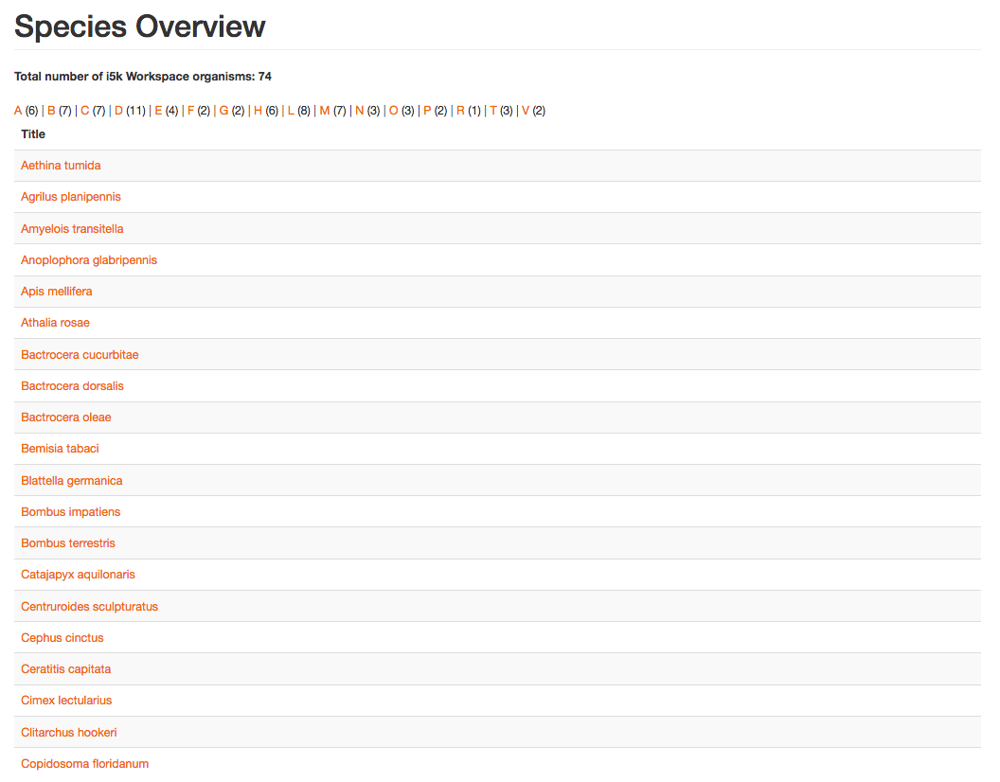

# Tripal 3 Species Glossary for i5k

This module aims to recreate the Species Glossary pages from the previous Tripal 2 instance on a Tripal 3 site.

Functionality desired:
 - Total count of i5k Workspace Organisms
 - A - Z glossary with count
 - On initial open, paginated list of all organisms (*Genus species*) as links

Legacy (Tripal 2):

